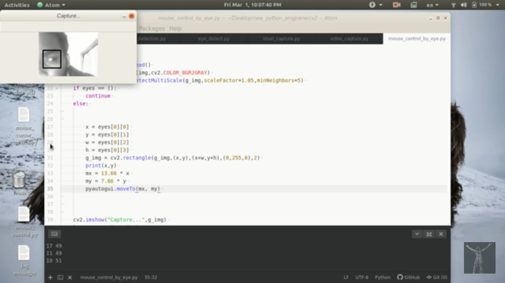

# Mouse Controll With Eye


[](https://pyautogui.readthedocs.io/en/latest/#:~:text=PyAutoGUI%20lets%20your%20Python%20scripts%20control%20the%20mouse,Linux%2C%20and%20runs%20on%20Python%202%20and%203.)

* :octocat: Version -v-1.0.0
* :octocat: License- GNU GPL V3.O

## DESCRIPTION:
* This Python🐍 Script helps to move a mouse cursor by using eye.
* This script just move the cursor➡️ not to click by eye👁 blink. 
* You can help me to add that feature.
* To access the feature you must have a webcam🎦 in your computer💻.

* The following Python library Modules required [openCV](https://pypi.org/project/opencv-python/) and [pyautogui](https://pypi.org/project/PyAutoGUI/) :
* You can download those by this pip commands.

---

## Run this script
```
#To create virtual envirionment
$ python -m venv python_dev

#To activate virtual envirionment
$ source python_dev/bin/activate #for linux 
$ .\venv\Scripts\activate #for windows power shell

## Download the requirement
#first try this
$ pip install -r requirement.txt

# If download not works then install manually
$  pip install cv2
#if not works then try this
$ pip install opencv-python
$ pip install pyautogui

#To run python script
$ python3 mouse_control_by_eye.py
$ q #To break from loop
```

---

See this [▶️Youtube](https://youtu.be/S0y8dxwbJzY) [](https://youtu.be/S0y8dxwbJzY)  link to see the demo Video.

* Credits : [Shameem Hameed](http://umich.edu/~shameem)

* I will appreciate :+1: any kind suggestions and help.
